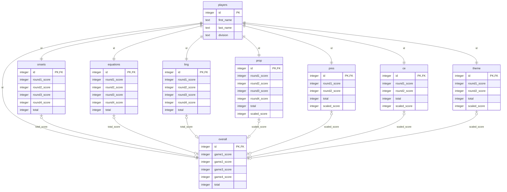

# AG Scoring
***
Recreation of scoring system used in Academic Games. Currently designed for local use.

## Database Schema
***
The overall database design is shown below. The actual column names may differ, but the structure is the same overall.

Everything is stored in a single database, with a division column to further sort players for rankings based on division. 
### Table Explanations
***
#### Players
Players are automatically assigned an ID number when added to the database. This ID is autoincremented per registered player and is referenced by all other games and the overall score tables.

#### Onsets, Equations, and Ling
References player ID from the players table, sorts individual scores for each round and stores the total score from all rounds.

#### Prop, Pres, CE, and Theme
Same as Onsets, Equations and Ling tables, but with a `scaled_total` column to scale the highest score to a max of 24.

#### Overall
Calculates the best game score from each subject area + next highest separately and also store the total combined score.

## TO-DO
***
- [ ] Create Registration System 
  - [ ] Drop-down for GUI version
- [x] Implement Database 
- [ ] Create CSV/PDF generator for scores
  - [ ] Auto-sort by division
- [ ] Terminal based system
  - [ ] GUI version
    - [ ] Auto updating score viewer?
    - [ ] Tabs to switch between score input and registration
- [x] Score Calculation System
  - [ ] Auto calculating scores
  - [x] Dynamic scaling reading games